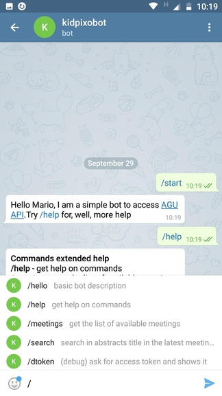
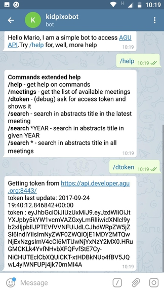
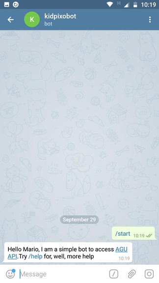
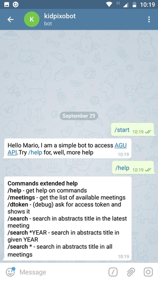

# Introduction

I cannot meet the AGU Open API contest deadline, so I'm giving all this to the comunity for free. Have fun!

This is a simple telegram bot to access [AGU API](https://api.developer.agu.org:8443/swagger-ui.html).

It is based on:

- [Python 3.4.7 documentation](https://docs.python.org/3.4/)
- [python-telegram-bot](https://github.com/python-telegram-bot/python-telegram-bot)
- [Telegram Bot API](https://core.telegram.org/bots/api)

This is a short animation of the bot working, hosted on my private VPS.


## Usage

1. Clone/Download this repo
2. Update in `api_agu.py` lines 38,39 your credential for [api.developer.agu.org](http://api.developer.agu.org/)
3. Update the Telegram bot token for your bot following [Bots: An introduction for developers](https://core.telegram.org/bots#creating-a-new-bot) 
4. Create a new python 3.X virtualenv on you machine `python -m venv BOTVENV`
5. Activate the virtualenviroment (bash) `source BOTVENV/bin/activate`
6. install the requirements `python -m pip -r requirements.txt`. This install:
    - attrs==17.2.0
    - python-telegram-bot==8.0
    - requests==2.18.4
7. execute the bot `python kidpixo-python-telegram-bot.py`
8. Done, you could interact on telegram.

**EXTRA** : to get the interactive menu you should pass the content of `setcommands.txt` to the Bothfather atfet the `\setcommands` for your bot. See [Botfather commands](https://core.telegram.org/bots#botfather-commands)

## Commands extended help

- **\\help** - get help on commands
- **\\meetings** - get the list of available meetings
- **\\dtoken** : ask for a new token and return a `api_agu.Token` object , with properities: `baseurl`, `lastUpdate`, `token`
- **\\search** - search in abstracts _title_ in the latest meeting
- **\\search** YEAR - search in abstracts _title_ in given YEAR
- **\\search \* ** - search in abstracts _title_ in all meetings

### Search options

Syntaxt:

```
\COMMNAND {*YEAR} text to search
```

Optional first word :

- `\*YEAR` is the year to limit the search to.

- `*` means all

- No `*YEAR` string at the beginning search only the lastest available year (hopefully the current meeting)


## Gallery

### blank


### commands


### dtoken


### hello


### help


### meetings


